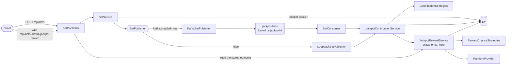
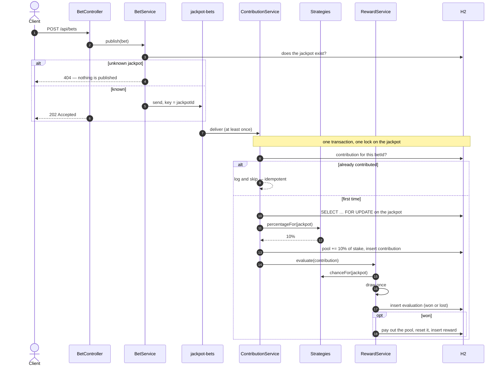
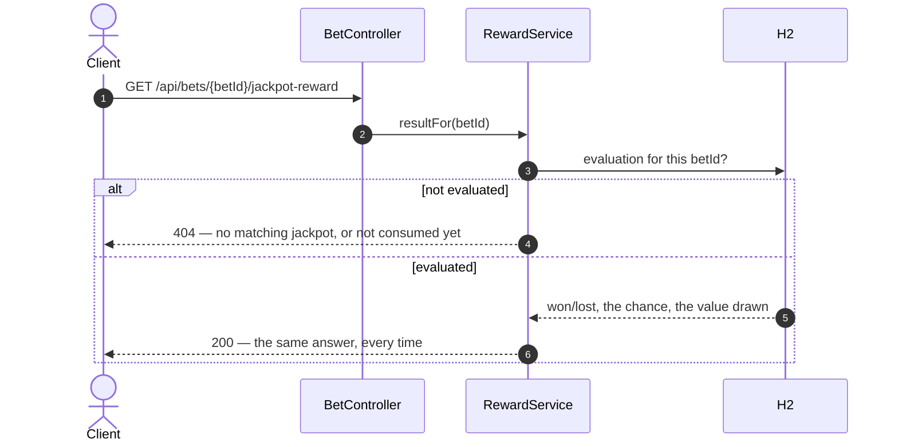
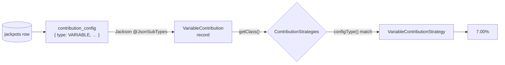

# Jackpot Contribution and Reward Service

A Spring Boot 3 / Java 17 backend that receives bets, contributes each one to a matching jackpot
pool and evaluates bets for a jackpot reward.

```
POST /api/bets ──► Kafka topic `jackpot-bets` ──► BetConsumer ──► contribute to the matching
                                                                  jackpot pool, then draw for
                                                                  the reward — once (H2)

GET /api/bets/{betId}/jackpot-reward ──► read the outcome that was already decided
```

## Running it

Two ways — both are self-contained and need no configuration.

### 1. With Kafka (Docker Compose)

```bash
docker compose up -d --build
```

```bash
docker compose logs -f app
```

The app is on <http://localhost:8080>, Kafka on `localhost:9094`, and **Kafka UI** on
<http://localhost:8081> — where you can browse the `jackpot-bets` topic, read the published bets and
watch the consumer group's lag. Stop everything with `docker compose down`.

### 2. Without any infrastructure

The Kafka producer is behind an interface. With `app.kafka.enabled=false` a loopback publisher
takes its place: it logs the payload that would have been published and hands the bet straight to
the contribution service, so every use case still works end to end.

```bash
mvn spring-boot:run -Dspring-boot.run.profiles=no-kafka
```

### Tests

```bash
mvn test
```

68 tests, no broker or database needed.

### End-to-end smoke test

```bash
./scripts/smoke-test.sh
```

Drives all four use cases against a running instance and asserts the amounts, not just the status
codes: the pool grows by the configured percentage, an unknown jackpot contributes nothing, a
redelivered bet is not counted twice, a pool at its limit pays out and resets, a replayed winner is
not paid twice, and an invalid bet is rejected. Works against either run mode; exits non-zero if any
expectation fails.

## Using it

### 1. Publish a bet (use case 1)

```bash
curl -X POST http://localhost:8080/api/bets -H 'Content-Type: application/json' \
  -d '{"betId":"0a5d7e12-8c3b-4f6a-9d21-5b7c1e4f8a30","userId":"7c9e6679-7425-40de-944b-e07fc1f90ae7","jackpotId":"33333333-3333-3333-3333-333333333333","betAmount":100.00}'
```

`202 Accepted` — the bet is published to `jackpot-bets`, consumed (use case 2) and contributed to
the matching jackpot (use case 3). A bet naming a jackpot that does not exist is rejected with
`404` **before** anything is published, so nothing unprocessable reaches the topic. Re-posting the
same `betId` is still accepted — retries are legitimate — and contributes only once.

### 2. Watch the pool

```bash
curl http://localhost:8080/api/jackpots/33333333-3333-3333-3333-333333333333
curl http://localhost:8080/api/jackpots/33333333-3333-3333-3333-333333333333/contributions
```

```json
{
  "id": "33333333-3333-3333-3333-333333333333",
  "name": "Demo",
  "initialPoolAmount": 100.00,
  "currentPoolAmount": 110.00,
  "contributionConfig": { "type": "FIXED", "percentage": 10.00 },
  "rewardConfig": { "type": "VARIABLE", "chancePercentage": 5.00, "increasePerStep": 10.00,
                    "poolStep": 50.00, "poolLimit": 200.00 }
}
```

### 3. Read the reward outcome (use case 4)

The bet was already evaluated when it was processed — this only reads the result.

```bash
curl http://localhost:8080/api/bets/0a5d7e12-8c3b-4f6a-9d21-5b7c1e4f8a30/jackpot-reward
```

```json
{
  "betId": "0a5d7e12-...", "userId": "7c9e6679-...", "jackpotId": "3333...", "won": true,
  "jackpotRewardAmount": 200.00, "chancePercentage": 100, "drawnValue": 42.7,
  "createdAt": "2026-08-04T10:26:35Z"
}
```

`200 OK` either way (`won` is the answer), `404` if the bet has not been evaluated — it named a
jackpot that does not exist, or it has not been consumed off the topic yet. `chancePercentage` and
`drawnValue` are recorded so an outcome can be explained rather than taken on trust.

### Full walkthrough

The demo jackpot (`3333...`) starts at 100, takes 10% of every stake and is guaranteed to pay out
once its pool reaches 200 — so a single big bet wins it:

```bash
BET=$(uuidgen); USER=$(uuidgen)
curl -X POST http://localhost:8080/api/bets -H 'Content-Type: application/json' \
  -d "{\"betId\":\"$BET\",\"userId\":\"$USER\",\"jackpotId\":\"33333333-3333-3333-3333-333333333333\",\"betAmount\":1000.00}"
curl http://localhost:8080/api/jackpots/33333333-3333-3333-3333-333333333333   # pool is now 200.00
curl http://localhost:8080/api/bets/$BET/jackpot-reward                      # won: true, 200.00
curl http://localhost:8080/api/jackpots/33333333-3333-3333-3333-333333333333   # pool back to 100.00
```

### API

**Swagger UI: <http://localhost:8080>** — the root path redirects there, and the OpenAPI document is
at `/v3/api-docs`. Every endpoint is documented with its semantics and a worked example, and you can
call them straight from the page.

**Postman:** import `postman/jackpot-service.postman_collection.json` (and the matching
`…environment.json`). It covers every endpoint plus an ordered *Walkthrough* folder that publishes a
bet, waits for the contribution, wins the jackpot and proves the winner is not paid twice — 42
assertions, runnable headlessly:

```bash
npx newman run postman/jackpot-service.postman_collection.json \
  -e postman/jackpot-service.postman_environment.json --delay-request 200
```

| Method | Path | Purpose |
|--------|------|---------|
| `POST` | `/api/bets` | Publish a bet to `jackpot-bets` (202); 404 if the jackpot doesn't exist |
| `GET` | `/api/bets/{betId}/jackpot-reward` | Read the bet's reward outcome (decided when it was processed) |
| `GET` | `/api/jackpots` | All jackpots with their configuration and current pool |
| `POST` | `/api/jackpots` | Create a jackpot (201, id in `Location`); 409 if the name is taken |
| `GET` | `/api/jackpots/{id}` | One jackpot |
| `PUT` | `/api/jackpots/{id}` | Rename and reconfigure; 404 if unknown, 409 if the new name is taken |
| `DELETE` | `/api/jackpots/{id}` | Delete (204); 409 once anything has contributed |
| `GET` | `/api/jackpots/{id}/contributions` | Contributions made to a jackpot, newest first |

### Creating a jackpot

```bash
curl -X POST http://localhost:8080/api/jackpots -H 'Content-Type: application/json' -d '{
  "name": "Weekend Special",
  "initialPoolAmount": 5000.00,
  "contribution": {"type":"VARIABLE","percentage":10.00,"minPercentage":2.00,
                   "decreasePerStep":1.00,"poolStep":1000.00},
  "reward": {"type":"FIXED","chancePercentage":10.00}
}'
```

The request configs are polymorphic: `type` selects the shape, and each shape declares and validates
exactly its own fields — a `VARIABLE` contribution missing `poolStep` is a 400 naming the field,
and a `FIXED` one carrying a `poolStep` is rejected rather than silently ignored. Adding a
configuration adds one record to `ContributionConfigRequest`; the existing ones are untouched.

Three deliberate restrictions. `initialPoolAmount` is fixed at creation, because the variable curves
are derived from `currentPool - initialPool` and changing it would retroactively move every
percentage the jackpot ever calculated. A jackpot that has contributions cannot be deleted — those
rows are the record of real bets. And **names are unique**: the id is a UUID, so the name is what
identifies a jackpot to a human in a log line, a support conversation or an admin screen, and two
jackpots called "Demo" would make all three ambiguous. The service checks before writing so the
error names the clash, and a unique index on the column is the backstop if two creates race past
that check — the same check-then-constrain pattern used for `betId`.

The H2 console is at <http://localhost:8080/h2-console> (JDBC URL `jdbc:h2:mem:jackpotdb`, user
`sa`, no password).

## Jackpot configurations

Every jackpot carries its own contribution and reward configuration. Each configuration is a
**record of exactly the fields its own rule needs**, stored as a JSON document, and each has a
matching strategy component. There is no enum and no type key: a strategy declares the config record
it handles and the registry resolves on that class, so the record *is* the discriminator.

Adding a configuration is a new record plus a new `@Component` — **no schema change, no migration,
and nothing existing modified.**

| | Contribution (% of the bet amount) | Reward chance |
|---|---|---|
| **FIXED** | Always the configured percentage | Always the configured percentage |
| **VARIABLE** | Starts at `percentage`, loses `decreasePerStep` points for every completed `poolStep` of pool growth, never below `minPercentage` | Starts at `chancePercentage`, gains `increasePerStep` points per completed `poolStep`, and is 100% once the pool reaches `poolLimit` |

"Pool growth" is `currentPool - initialPool`, so both variable curves reset together with the pool
when the jackpot is awarded.

### Seeded jackpots (`config/SampleDataLoader`)

Ids are fixed and deliberately memorable, so the docs, the Postman collection and the smoke test
can address them:

| Name | Id | Initial pool | Contribution | Reward chance |
|------|----|--------------|--------------|---------------|
| Daily Fixed | `1111…1111` | 10 000 | fixed 5% | fixed 10% |
| Progressive Weekly | `2222…2222` | 5 000 | 10% → 2%, -1 point per 1 000 of growth | 1% → +2 points per 1 000 of growth, certain at 20 000 |
| Demo | `3333…3333` | 100 | fixed 10% | 5% → +10 points per 50 of growth, certain at 200 |

H2 is in-memory, so restarting the app restores exactly this state.

## How it works

Two independent flows share one piece of state: the jackpot's pool.



### Placing a bet, and contributing it

Publishing is synchronous and validated; contributing happens later, on the consumer.



The draw happens **here**, not when a client asks. That is deliberate: while it lived in the endpoint
and only wins were stored, a losing bet left no trace and could simply be asked again until it won.

### Reading the outcome

Nothing draws here. The bet was evaluated when it was processed, and this is a read of that record.



### How a configuration finds its strategy

No enum and no type key: the config record's own class is the discriminator, on both sides of the
database.



## Design notes

**Layering.** `controller → service → repository / messaging`. Controllers and the Kafka consumer
are thin; the business rules live in the services and on the entities (`Jackpot.contribute`,
`Jackpot.awardPool`, `Jackpot.poolGrowth`).

```
com.sporty.jackpot
├── controller     BetController, JackpotController, ApiExceptionHandler
├── service        BetService, BetProcessingService, JackpotContributionService,
│                  JackpotRewardService, JackpotService
│   ├── contribution   ContributionStrategy (FIXED, VARIABLE) + ContributionStrategies registry
│   └── reward         RewardChanceStrategy (FIXED, VARIABLE) + registry, RandomProvider
├── messaging      BetPublisher, LoopbackBetPublisher
│   └── kafka          KafkaBetPublisher, BetConsumer
├── repository     JackpotRepository, JackpotContributionRepository, JackpotRewardRepository
├── model          Jackpot, JackpotContribution, JackpotEvaluation, JackpotReward,
│                  the config records behind sealed interfaces, Money
├── dto            Bet, JackpotRewardResult
└── config         KafkaTopicConfig, SampleDataLoader, ClockConfig, OpenApiConfig, WebConfig
```

**Adding a configuration.** Write a record implementing `ContributionConfig` (or `RewardConfig`)
holding exactly the fields the rule needs and validating them in its compact constructor; register
it on the interface's `@JsonSubTypes` so it can be persisted and accepted over the API; then write a
`@Component` implementing `ContributionStrategy<YourRecord>` that returns `YourRecord.class` from
`configType()`. The registry builds itself from the injected list of strategies and resolves by that
class, so nothing else has to know about it.

**Configuration storage.** The configs are two JSON columns on `jackpots`, not a column per field.
Flattening them would mean a column set that is mostly null for any given jackpot — a union type in
the schema — and every new rule shape would need a migration. As JSON, the record *is* the document,
the `type` property is the discriminator Jackson reads and writes, and the shapes stay polymorphic
in a way JPA `@Embeddable` structurally cannot be. The cost is real and worth naming: no `NOT NULL`
or `CHECK` constraints on config fields, no straightforward SQL filtering on them, and old and new
document shapes can coexist silently in the column, so evolution is an application concern.

**The draw happens once, and the system chooses when.** A bet is evaluated by the pipeline
immediately after it contributes, inside the same transaction and the same lock. The endpoint is a
read. That closes two holes that a client-triggered draw leaves open: choosing *when* to claim (and
so waiting for the pool and the chance to grow), and asking again after a loss until it wins — with
a flat 10% chance, 22 requests give a 90% chance of taking the pool, for free.

The mechanism is `jackpot_evaluations`, which records **every** evaluation, win or loss, unique per
`betId`. It also stores the chance and the value drawn, so an outcome can be explained afterwards
rather than taken on trust. `JackpotReward` remains the payout record, written only for winners.

**Idempotency.** Kafka redelivers, and clients retry. A bet contributes at most once (`betId` is
unique on `jackpot_contributions`, and the service checks before acting) and is evaluated at most
once (`betId` is unique on `jackpot_evaluations`).

**Concurrency.** Both flows read-modify-write the pool, so the jackpot row is taken with a
pessimistic write lock (`JackpotRepository.findByIdForUpdate`) inside the transaction.

**Ids.** Every business id — bet, user, jackpot — is a `UUID`, in the API, on the Kafka payload and
in the database. Ids that are not valid UUIDs are rejected with 400 rather than reaching a service.
A jackpot also carries a `name`, because a UUID tells a human nothing.

**Validate at the edge, stay tolerant at the consumer.** `POST /api/bets` checks the jackpot exists
before publishing and answers 404 if it does not — the client gets a real answer instead of a 202
followed by silence, and the topic never carries a message that cannot be processed. That check is
not a guarantee, though: the jackpot could be removed between the check and delivery, and Kafka can
redeliver. So the consumer keeps its own "no matching jackpot → skip" and "already contributed →
skip" branches. The edge check is for the caller; the consumer branches are for correctness.

**Money.** `BigDecimal` throughout, rounded HALF_UP to 2 decimals in one place (`Money`).

**Randomness** sits behind `RandomProvider`, so the reward draw is deterministic in tests.

## Working on it with an agent

The repo carries its own agent setup in `.claude/`, so the conventions above are enforced by
tooling rather than by memory:

- **Skills** (`.claude/skills/`) — `add-jackpot-configuration` (the extension point: a new
  contribution or reward rule is a new strategy, never an `if`), `add-feature`, `add-messaging-flow`,
  `verify-service` (run it and prove it works), `debug-pipeline` (symptom → cause).
- **Agents** (`.claude/agents/`) — `jackpot-reviewer` reviews a change against the layering,
  idempotency, concurrency and money rules; `test-author` writes tests in the house style.
- **Commands** (`.claude/commands/`) — `/pr-ready` runs the whole delivery gate, `/demo` walks the
  four use cases live.
- **`.claude/settings.json`** allowlists the build and verification commands and hooks a reminder to
  run `mvn test` onto every change under `src/main/java` — the Docker image builds with
  `-DskipTests`, so that is the only automated gate.
- **`CLAUDE.md`** is the entry point: commands, message flow, architecture map, conventions and
  gotchas.

Labelling a GitHub issue `claude` runs the pipeline in `.github/workflows/claude.yml`, which puts
each stage on the model that fits it: **Opus 5** plans (and specifies the tests), **Sonnet 5**
implements and opens the PR, **Haiku 4.5** writes those tests and runs `mvn test`, then **Opus 5**
reviews and blocks the merge unless it approves. Implementation and tests are deliberately separate
agents — the one that wrote the code doesn't get to decide its own tests are sufficient, and a
failing test is reported rather than weakened. Needs the `ANTHROPIC_API_KEY` repository secret.

### Trade-offs worth naming

- The contribution row *is* the persisted bet: it carries bet id, user id, jackpot id and stake, so
  a separate `bets` table would only duplicate it. A bet with no matching jackpot is therefore not
  stored — it also cannot win a reward, which is the intended behaviour.
- Kafka uses one partition and keys bets by jackpot id, which keeps contributions to one jackpot
  ordered. With more partitions and consumers the row lock is what keeps the pool correct.
